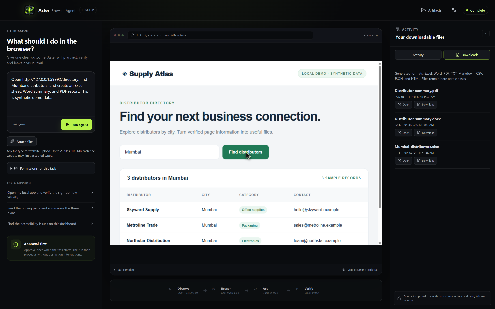

<div align="center">


# Aster Browser Agent

### Your browser. With an agent.

Describe a task, approve its limits, and watch Aster work in Chrome.<br />
Bring your own AI provider. Take your results home as real files.


[](https://github.com/Porallanagaraju13/aster-browser-agent/releases/download/v0.12.1/Aster-Browser-Agent-0.12.1-Windows-x64.exe)
[](https://github.com/Porallanagaraju13/aster-browser-agent/releases/tag/extension-v0.1.1)

[Release & downloads](https://github.com/Porallanagaraju13/aster-browser-agent/releases/tag/v0.12.1) · [Getting started](#-start-in-minutes) · [User guide](docs/USER_GUIDE.md) · [Development](#-for-developers)

</div>

> **Choose your edition.** The Windows `.exe` is in **Releases → v0.12.1 → Assets**. The standalone Chrome extension ZIP is in **Releases → extension-v0.1.1 → Assets**. This repository and its downloads are public. GitHub’s automatic source-code ZIP is for developers, not the packaged application.

## 🧩 New: standalone Chrome extension

Use Aster directly beside your current webpage — no desktop app, backend folder or `.env` file. Bring an **OpenRouter, Groq or Google Gemini API key and exact model ID**, review the task’s website access, watch visible actions, and download real Excel, Word, PDF and text files.

**Install:** download the [extension ZIP](https://github.com/Porallanagaraju13/aster-browser-agent/releases/tag/extension-v0.1.1), extract it, open `chrome://extensions`, enable **Developer mode**, choose **Load unpacked**, and select the folder containing `manifest.json`. Click Aster’s toolbar icon on a website.

**New in extension v0.1.1:** select **Google Gemini** to use a Google AI Studio API key directly — no OpenRouter key required. Gemini plans the same validated browser actions as the other providers; this is **not Gemini Native/computer-use mode**. Existing users should follow the [unpacked-extension upgrade steps](extension/README.md#upgrade-an-existing-unpacked-installation); re-enter the session-only key after reloading.

| Desktop app | Browser extension beta |
| --- | --- |
| Windows portable EXE; separate isolated Chrome profile | Runs in desktop Chrome’s side panel and current signed-in tab |
| OpenRouter, Groq and Gemini | OpenRouter, Groq and direct Google Gemini |
| OS-encrypted persistent credentials | Session-only key; paste it again after restarting Chrome |
| Multiple-tab tools and run recordings | Single active tab, visible DOM actions, no screenshot streaming |

[Extension setup and limitations](extension/README.md) · [Privacy](extension/PRIVACY.md) · [Public store submission checklist](extension/STORE_SUBMISSION.md)

The GitHub extension release is a **beta unpacked download**, not an approved Chrome Web Store listing. The desktop documentation below still describes the Windows edition.

## ✨ Meet your browser workspace



<p align="center"><sub>Actual Aster application screen. Demonstration uses sample data and mock AI responses, not a live model run.</sub></p>

## 🚀 Start in minutes

1. **Download** [Aster for Windows x64](https://github.com/Porallanagaraju13/aster-browser-agent/releases/download/v0.12.1/Aster-Browser-Agent-0.12.1-Windows-x64.exe).
2. **Open** `Aster-Browser-Agent-0.12.1-Windows-x64.exe` directly. No installer or separate backend folder is needed.
3. **Connect your model.** Choose OpenRouter, Groq, or Google Gemini; paste your own API key and the exact model ID from that provider. Select **Validate and continue**.
4. **Describe your task.** Select **Run agent**, review the scope, and choose **Approve task** once.
5. **Watch and collect.** Follow visible browser actions and the timeline, then use **Open** or **Download** in **Downloads** for the results.

Try a small first task:

```text
Open https://example.com, verify the page heading,
and create a short Word document explaining the page.
```

### What you need

| Required | Details |
| :--- | :--- |
| 💻 Windows x64 | The downloadable release is a portable Windows desktop application. |
| 🌐 Google Chrome | Install Chrome separately. Aster uses its own isolated browser profile. |
| 🔑 Your own API key | OpenRouter, Groq, or Google Gemini; provider usage may incur charges. |
| 🧠 A compatible model | Enter an exact model ID with tool/function calling support. Vision is optional for OpenRouter/Groq. |
| 📡 Internet | Required for provider requests and browsing websites. |

**You do not need Node.js, Python, backend source files, or an `.env` file to run the portable EXE.** Each person enters their own key and model. Settings can be changed later in the application.

> **Windows notice:** this prototype is unsigned, so Windows may display an unknown-publisher warning. Verify the source and release checksum before running it. Do not disable your antivirus or system security protections.

## ⚡ What Aster can do

| Capability | In the application |
| :--- | :--- |
| 🖱️ Visible browser actions | Navigate, click, type, scroll, hover, select, check controls, and switch tabs. A visible cursor and click ripple show the target. |
| 👁️ Verified page observations | The model receives a semantic page map; vision-capable models also receive screenshots. The app preview updates after verified observations. |
| 🛡️ One approval per task | Review navigation, forms, sensitive-input, and consequential-action limits before the run. Use **Stop** to cancel. |
| 📎 Website uploads | Attach local files with the native picker and let the agent upload them to the approved destination. |
| 📊 Downloadable results | Generate spreadsheets and documents, or download files from websites. Open them or save a copy. |
| 🎬 Evidence you can review | Inspect screenshots, per-tab WebM recordings, an event timeline, and a run summary. |
| 🔐 Your own configuration | Provider keys are encrypted locally using Electron `safeStorage`; Windows uses the operating system's DPAPI. |

The dedicated Chrome window shows browser activity live. The application contains a verified, action-by-action preview—not a continuous video stream of Chrome.

## 📁 Real files, ready to use

| Output | Formats |
| :--- | :--- |
| Spreadsheets | Excel `.xlsx` |
| Documents | Word `.docx`, PDF `.pdf` |
| Text & structured data | `.txt`, `.md`, `.csv`, `.json`, safe `.html` |
| Website downloads | Original format supplied by the website |
| Run evidence | Screenshots, WebM recordings, `events.jsonl`, `summary.md` |

**Uploads:** up to 20 files, 100 MB per file, and 500 MB total. File extensions are not restricted by Aster, but the destination website's requirements still apply. Attaching a file authorizes its upload; it does **not** imply the model can read every document format.

**Outputs:** requested formats are checked against nonempty files created in that run. Unsupported formats or missing requested files result in an incomplete task, not a renamed substitute. Review generated content for accuracy before using it.

## 🧭 Stay in control

- **Scope each task.** Forms, sensitive inputs, and consequential actions are off by default. Actions detected outside the approved scope stop the run; permissions expire when it ends.
- **Know what leaves your device.** Task text, attachment paths, page content, and vision screenshots are sent to your selected model provider. Uploaded file bytes go to the destination website.
- **Keep artifacts private.** Chrome cookies persist in the isolated profile. Screenshots, recordings, and exported documents may contain sensitive information.
- **Share the EXE only.** Do not distribute your API keys, settings, browser profile, or run artifacts with the application.
- **Use human review.** Website behavior and AI decisions can be wrong. Aster is a guarded prototype, not a complete security sandbox or a guarantee that every task succeeds.

For detailed upload rules, privacy behavior, and permission boundaries, see the [user guide](docs/USER_GUIDE.md#approval-model).

## 🛠️ For developers

Built with **Electron · React · TypeScript · Playwright · Vite**. The desktop app bundles the local agent backend and recording runtime; Chrome remains a separate prerequisite.

Use Node.js 20+ for source development. The portable smoke test requires Node.js 22+. Windows packaging must run on Windows.

```powershell
git clone https://github.com/Porallanagaraju13/aster-browser-agent.git
cd aster-browser-agent
npm ci
npm run dev
```

This repository is public. For normal use, download the appropriate release instead of building from source.

| Command | Purpose |
| :--- | :--- |
| `npm run typecheck` | Check main, preload, renderer, and test types |
| `npm test` | Run automated unit and browser integration tests |
| `npm run test:e2e` | Test onboarding, production UI, accessibility, and documents |
| `npm run build` | Create production bundles |
| `npm run package:win` | Build the portable Windows EXE in `release/` |
| `npm run test:portable` | Test the packaged EXE, browser actions, and recording |

**v0.12.1 validation:** 89 automated tests passed, along with the packaged browser-action and recording check. The portable check uses an isolated profile and mock provider; it does not replace testing on a separate Windows machine or validating your own provider/key/model.

<details>
<summary><strong>How a task flows through Aster</strong></summary>

```text
Describe → Approve → Observe → Act → Verify → Export
                       ↑              │
                       └──────────────┘

Electron UI → context-isolated IPC → local agent runner
                                     ├─ selected AI provider
                                     └─ Playwright → isolated Chrome
```

The agent uses short page references rather than asking the model to invent CSS selectors. Each completed action returns a fresh page observation. Step limits, cancellations, and missing deliverables produce explicit outcomes.

</details>

## 📚 Go deeper

- [User & developer guide](docs/USER_GUIDE.md) — setup, commands, uploads, permissions, browser behavior, and packaging.
- [Enhancements](ENHANCEMENTS.md) — known limitations and planned improvements.
- [Third-party notices](THIRD_PARTY_NOTICES.md) — bundled recording-runtime notices.
- [Release v0.12.1](https://github.com/Porallanagaraju13/aster-browser-agent/releases/tag/v0.12.1) — portable application, release notes, and checksums.

---

<p align="center">
<strong>Aster · Your browser. With an agent.</strong><br />
<sub>An independent project inspired by observable browser-agent workflows. Not a Google product and not affiliated with Google Antigravity.</sub>
</p>
