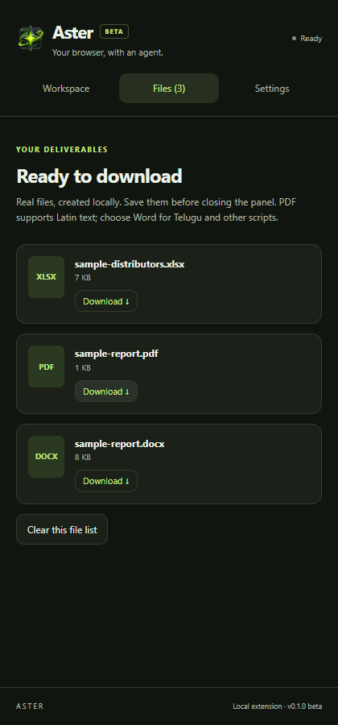

# Aster Chrome Extension

Your browser, with an agent — in a side panel. Standalone: no desktop app, backend, Node.js or `.env` file is needed to use the packaged extension.

**v0.1.1 beta · Chrome 120+ · OpenRouter + Groq + Google Gemini · Bring your own API key and exact chat-model ID**



*Actual extension UI from an isolated Chromium test using synthetic data and mock AI responses.*

## Install the GitHub release

1. Download **Aster-Chrome-Extension-0.1.1.zip** from the [extension release](https://github.com/Porallanagaraju13/aster-browser-agent/releases/tag/extension-v0.1.1), not GitHub’s source-code ZIP.
2. Extract it into a permanent folder. The extracted folder must directly contain `manifest.json`.
3. In Chrome, open `chrome://extensions` and enable **Developer mode**.
4. Choose **Load unpacked** and select that extracted folder.
5. Open a normal website, pin Aster from Chrome’s Extensions menu, and click its toolbar icon.
6. In **Settings**, choose OpenRouter, Groq or Google Gemini and paste your own API key and exact model ID for that provider. Save.
7. Describe a task, review allowed website origins and optional capabilities, approve the task, and click **Start task**. Keep the selected tab and panel open.
8. Generated files appear in **Files**. Click **Download** before closing the panel.

Developer mode is local installation, not a Chrome Web Store listing. The GitHub ZIP works on desktop Chrome for Windows, macOS and Linux; the isolated automated test was run on Windows Chromium. Other OS/browser combinations still need manual verification. Mobile Chrome does not support this installation method. Do not disable Chrome security protections. Organizations may prohibit unpacked extensions.

## Use a Google Gemini key directly

1. Obtain your own Gemini API key from [Google AI Studio](https://aistudio.google.com/apikey). Review the applicable account, region, billing and quota requirements in Google's service.
2. In Aster **Settings**, choose **Google Gemini** and paste that Google API key. You do **not** need an OpenRouter key for this provider.
3. Paste the exact supported Gemini text/chat-model ID available to your account, not its display name or a webpage URL. If the ID includes the leading `models/` prefix, Aster removes that prefix when saving. No default or “latest” model is assumed.
4. Save, return to the website, and approve a task as usual. Clicks, typing, scrolling, navigation, selected-file uploads and downloadable documents use Aster's existing scoped actions.

This connects directly to Google's [OpenAI-compatible Gemini API](https://ai.google.dev/gemini-api/docs/openai). It is **not Gemini Native/computer-use mode**: Gemini returns a proposed action and Aster validates and performs it locally. Selecting Gemini does not grant extra tabs, unrestricted computer access, screenshots or new document-reading capabilities.

Google's data-handling rules differ for paid and unpaid Gemini services. Review the [Gemini API terms](https://ai.google.dev/gemini-api/terms) and Aster's [privacy policy](PRIVACY.md) before sharing page or attachment content; do not submit confidential data to a service whose terms are inappropriate for it. Available models, limits and charges depend on your Google account.

## Upgrade an existing unpacked installation

1. Stop any running task and download files you want to keep. Panel activity and generated files are temporary.
2. Download and extract the new **Aster-Chrome-Extension-0.1.1.zip**; verify its release checksum.
3. Either replace the old packaged contents inside the existing extension folder with the newly extracted contents, then click Aster's **Reload** button at `chrome://extensions`; **or** remove the old Aster extension and use **Load unpacked** to select the newly extracted folder. Do not leave two Aster versions enabled.
4. Confirm Chrome shows **version 0.1.1**. Review any new access prompt: this release adds the Google Gemini API host for direct Gemini requests.
5. Open Aster's toolbar icon on a website, choose your provider/model and paste your API key again. Session-only keys clear on extension reload/update; this is expected. Removing the extension also removes saved preferences.

Keep the loaded folder in a permanent location. Unpacked GitHub installations do not receive automatic Chrome Web Store updates. No backend files or `.env` file need to be copied.

## What this release does

| Capability | Extension behavior |
| --- | --- |
| Browser actions | Read page text and controls; navigate within approved origins; click, fill, select, scroll, press supported keys, and upload approved files. |
| Visible work | A small cursor marker and click ripple appear on the actual webpage. No screenshot stream, mirrored browser, or repeated reload cycle. |
| Task control | One reviewed task scope, Stop, a 1–75 step limit, an 8-minute deadline, and fail-safe limits on consecutive errors. |
| AI connection | Direct HTTPS requests to OpenRouter, Groq or Google Gemini using your chosen text/chat model. No bundled/shared key. Provider charges apply. |
| Documents | Real XLSX, DOCX, PDF, TXT, MD, CSV, JSON and inert HTML files, created locally and downloadable through Chrome. |
| Attachments | Up to 10 selected files, 10 MiB each and 20 MiB total. Any binary type may be attached for upload; destination restrictions still apply. |

Example: **“Read the distributor table on this page and create an Excel sheet with the listed names and contacts. Do not invent missing data.”**

Keys are held only in `chrome.storage.session`, restricted to trusted extension contexts. They are cleared on browser restart, extension reload/update/disable, or **Forget API key**. Only provider/model preferences persist locally. This is session storage, not an encrypted persistent credential vault.

## Important limits

- Beta, not a universal or guaranteed browser automation system. Model quality, website design and network conditions affect results. Review consequential actions and generated data.
- Only the selected, active tab is automated. Switching tabs, closing the tab/panel, or leaving approved websites prevents subsequent actions. No unrelated tabs, popup automation, screenshots, cookies API or arbitrary model-generated JavaScript.
- Chrome internal pages, the Chrome Web Store, local files, closed shadow roots, cross-origin frames, CAPTCHAs and trusted-input-only controls may require manual work. Synthetic DOM events cannot fully emulate all browser input.
- Allowed origins are checked before commands and after navigation. A website’s own script may navigate or auto-submit after a click; DOM automation is not a network firewall and cannot undo an already-sent action. English-label heuristics do not reliably classify every consequential control.
- Optional origin permissions may remain granted in Chrome after a task. Runtime scope is still checked on every task. Revoke site permissions from the extension’s Chrome settings when no longer needed.
- Task prompts, observed page/element text, limited prior evidence and supported attachment text are sent to the selected AI provider. Do not include unnecessary secrets. Website/attachment text is treated as untrusted data, but prompt-injection resistance is not a guarantee.
- Attachment reading: UTF-8 text/code and limited DOCX main text/XLSX cached cell values; first 30,000 characters extracted per file, with a smaller provider context budget. No OCR, PDF parsing, formula evaluation, images, slides or full document-layout understanding. Other files are marked **upload only**.
- PDF output supports Latin/Windows-1252 text. Use DOCX/TXT for Telugu, other non-Latin scripts and emoji; unsupported PDF text produces an error instead of corrupt characters. HTML output is an inert text report, not executable web content.
- Per model action: up to 1,000 spreadsheet rows / 50 columns or 120,000 text characters (provider output limits may be lower). Large exports need narrower tasks. At most 10 generated files per run. Files/activity are panel-memory only; download before closing. Existing website download links are not automated in this beta.
- Closing the panel stops work; there is deliberately no hidden/resumable background run. Restarting Chrome requires pasting the key again.

## Development

From this `extension` directory:

```powershell
npm ci
npm test
npm run build
npm run test:e2e
npm run test:sidepanel
npm run package
```

Load `extension/dist` unpacked when developing. `npm run dev` rebuilds on changes; use Chrome’s extension **Reload** button afterward. The extension is independent of the root Electron build.

The E2E provider defaults to OpenRouter. Set `$env:ASTER_TEST_PROVIDER='gemini'` or `'groq'` before `npm run test:e2e` to verify the other provider paths. All three use synthetic keys and intercepted responses, never paid model calls. Native side-panel smoke verifies the Google Gemini settings flow. On a resource-constrained machine, run suites sequentially and use `npm test -- --maxWorkers=1`.

E2E uses a fresh temporary Chromium profile, a local synthetic directory and mocked provider responses. A temporary manifest copy pregrants only the synthetic localhost origin because native permission dialogs cannot be accepted headlessly. Denied permission/cancellation paths are unit-tested; manually verify Chrome's native permission prompt. The separate side-panel smoke test uses the unchanged production manifest and verifies actual panel creation, settings interaction and destruction/pagehide on close. It does not use personal Chrome sessions, production credentials or paid AI. Install matching test Chromium with `npx playwright-core install chromium`, or set `ASTER_TEST_CHROMIUM` to a compatible Chromium binary. Packaged Chrome no longer supports the command-line sideload flags used by automated tests. No test hooks, mock provider or test host permissions ship in the release ZIP.

## Distribution

GitHub provides a checksummed unpacked ZIP. For a public store installation button and automatic store updates, complete the [Chrome Web Store submission checklist](STORE_SUBMISSION.md). An owner developer account, registration/verification, accurate declarations and Google review are required. No public store listing is claimed until it is approved/live.

Read the [privacy policy](PRIVACY.md). Report issues through the [public GitHub issue tracker](https://github.com/Porallanagaraju13/aster-browser-agent/issues); never paste API keys, credentials or private page contents.
